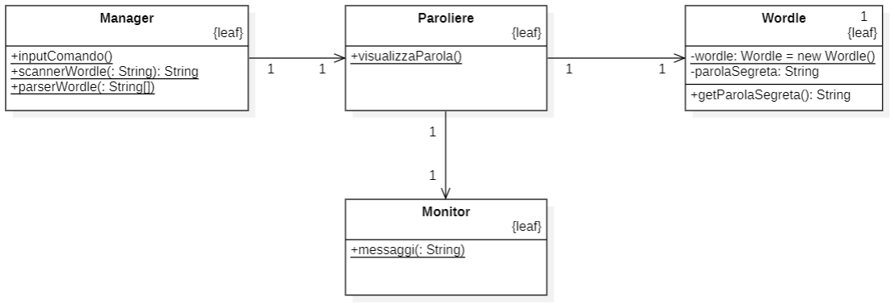
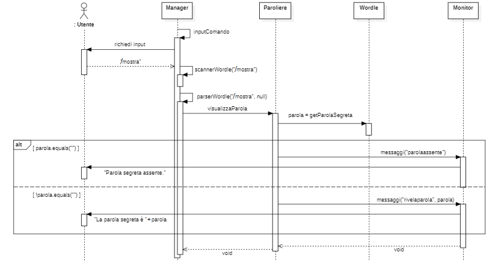

# INDICE
## 1. - <a href=#intro> INTRODUZIONE</a>
## 2. - <a href=#modd> MODELLO DI DOMINIO</a>
## 3. - <a href=#rspec> REQUISITI SPECIFICI</a>
#### 3.1 - <a href=#rnfunz> REQUISITI NON FUNZIONALI</a>
#### 3.2 - <a href=#rfunz> REQUISITI FUNZIONALI</a>
## 4. - <a href=#syd> SYSTEM DESIGN</a>
## 5. - <a href=#ood> OO DESIGN</a>
## 6. - <a href=#test> RIEPILOGO DEL TEST</a>
## 7. - <a href=#mut> MANUALE UTENTE</a>
## 8. - <a href=#pso> PROCESSO DI SVILUPPO E ORGANIZZAZIONE DEL LAVORO</a>
## 9. - <a href=#retro> ANALISI RETROSPETTIVA</a>
#### 9.1 - <a href=#sp1> SPRINT 1</a>

   

<h2 id="intro"> 1. Introduzione </h2>

`Wordle` è un famoso gioco di proprietà di `The New York Times Company`, rilasciato nell'ottobre 2021 da Josh Wardle, che consiste nell'indovinare una parola di cinque lettere avendo a disposizione sei tentativi, ognuno dei quali fornisce delle informazioni al giocatore; in particolare per ogni lettera viene indicato se essa è corretta, presente ma nella posizione sbagliata o assente.  
Questo programma software, dotato di interfaccia a linea di comando (CLI), è stato sviluppato, nell'ambito del corso universitario di Ingegneria del Software, nella sua interezza dal `gruppo Stonebraker`, che prende il nome dall'omonimo vincitore del premio Turing Award del 2014 per il suo immenso contributo alla ricerca nell'ambito dei database. 
Il gruppo è composto da Adriana Frascella, Nicola Lassandro, Matteo Castano, Daniele Guerra, Ugo De Santis; 
Responsabile del progetto il Professore Filippo Lanubile.

   

<h2 id="modd"> 2. Modello di dominio </h2>

<h3>Diagramma concettuale </h3>

   

<h2 id="rspec"> 3. Requisiti specifici </h2>
<h3 id="rnfunz"> 3.1 Requisiti non funzionali </h3>

In termini di **portabilità**:
+ Grazie a `Docker` la distribuzione dell'applicazione è automatizzata, tramite quest'ultimo è possibile ottenere un'astrazione a livello di sistema operativo che consente l'utilizzo dell'applicazione su qualunque macchina. 
+ è possibile scaricare il programma tramite il comando da console: 
    `docker pull ghcr.io/softeng2122-inf-uniba/wordle-stonebraker:latest`
+ è possibile eseguire il programma tramite il comando da console: 
    `docker run -it --rm ghcr.io/softeng2122-inf-uniba/wordle-stonebraker:latest`

In termini di **usabilità**:
+ il corretto funzionamento dell'applicazione ha come requisito imprescindibile la codifica UTF-8 da parte della console utilizzata(Linux terminal, MacOS terminal, Windows Powershell e Git Bash, se si utilizza quest'ultimo il comando ha prefisso *winpty*). 

In termini di **requisiti organizzativi**:
+ Il programma è stato realizzato applicando `Scrum`, una metodologia di sviluppo **agile**. Questa prevede cicli di sviluppo brevi (una/due settimane massimo) denominati sprint, ognuno dei quali vede l'introduzione di un certo numero di `user story` (funzionalità) richieste dal Product Owner. 

<h3 id="rfunz"> 3.2 Requisiti funzionali </h3>

I requisiti cui l'applicazione risponde sono: 
+ L'utente può visualizzare l'elenco dei comandi mediante il comando `/help` 
+ L'utente può chiudere l'applicazione mediante il comando `/esci` 
+ Il paroliere può impostare una nuova parola segreta mediante il comando `/nuova
    [parola]` 
+ Il paroliere può mostrare la parola segreta mediante il comando `/mostra` 
+ Il giocatore può iniziare una nuova partita mediante il comando `/gioca` 
+ Il giocatore, all'interno della partita, può `effettuare un tentativo`
    semplicemente inserendo una parola  
+ Il giocatore può abbandonare la partita corrente mediante il comando 
    `/abbandona` 

   

<h2 id="ood"> 5. OO Design </h2>
Analizzando le varie necessità e documentazioni abbiamo ritenuto necessario dividere il nostro progetto in 5 classi: 

+ `Giocatore` e `Paroliere` che si occupano di gestire i comandi di interesse, rispettivamente, dei due tipi di utente; 
+ `Wordle` gestisce il funzionamento totale del gioco; 
+ `Partita` gestisce le caratteristiche della singola partita; 
+ `Manager` che si occupa dell'acquisizione dei comandi dati in input dall'utente. 
+ `Monitor` che si occupa della restituzione a schermo dei messaggi di output.  

Abbiamo individuato alcune `user story di maggiore rilevanza` di cui sono riportati diagrammi delle classi e diagrammi di sequenza: 

<h3>impostaParolaSegreta </h3>

 

<h3>visualizzaParola </h3>

 

<h3>iniziaPartita / Effettuare Tentativo </h3>

   

<h2 id="test"> 6. Riepilogo del test </h2>

<h3>Coveralls</h3>

Siamo riusciti a raggiungere un ottimo risultato dal punto di vista della copertura dei casi di test del nostro progetto. 
Gli unici test che non abbiamo potuto coprire e che non ci hanno permesso di raggiungere una copertura totale del 100% sono quelli che richiedevano all'utente un ulteriore input da tastiera in fase di esecuzione del metodo soggetto al test.

<h3>Sommario test</h3>

Implementando `85 casi di test` siamo arrivati al seguente risultato:
+ 289 of 299 relevant lines covered (96.66%) 

<h3>Spotbugs</h3>

Qualsiasi bug segnalatoci dall'apposito tool di Gradle, Spotbugs, è stato prontamente rimosso.

<h3>Checkstyle</h3>

Abbiamo provveduto a rimuovere dal nostro codice qualsiasi errore stilistico, indicatoci dal tool di Gradle: Checkstyle.
